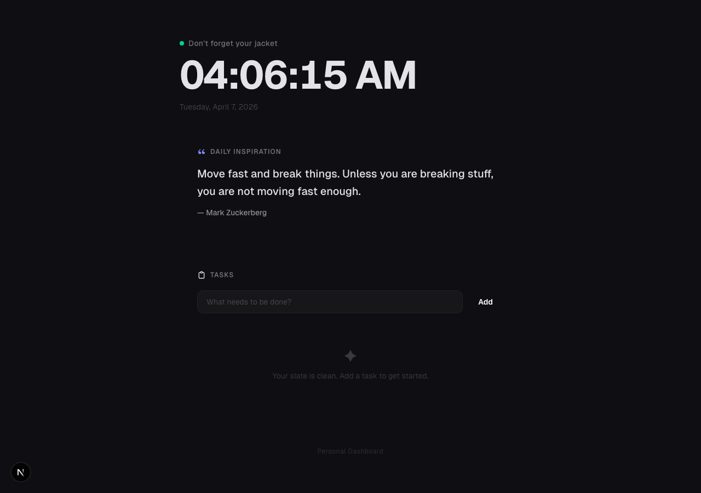

# Personal Dashboard

A sleek, glassmorphism-styled personal dashboard built with Next.js, TypeScript, and Tailwind CSS.



## Features

- **Live Clock** — real-time display with contextual greetings and full date
- **Daily Quotes** — random motivational quotes from founders and builders
- **Task List** — add, complete, and remove tasks with localStorage persistence and a progress bar

## Design

- Dark-only theme with animated gradient mesh background
- Glassmorphism cards with frosted blur and hover glow effects
- Smooth entrance animations, spring-loaded checkboxes, and gradient accents
- Fully responsive layout

## Getting Started

```bash
npm install
npm run dev
```

Open [http://localhost:3000](http://localhost:3000).

## Tech Stack

- [Next.js 16](https://nextjs.org/) (App Router)
- [TypeScript](https://www.typescriptlang.org/)
- [Tailwind CSS v4](https://tailwindcss.com/)
